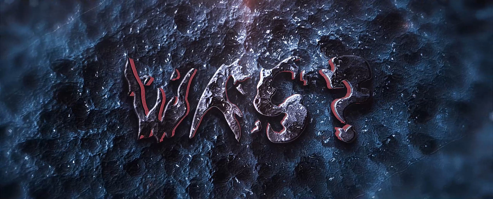
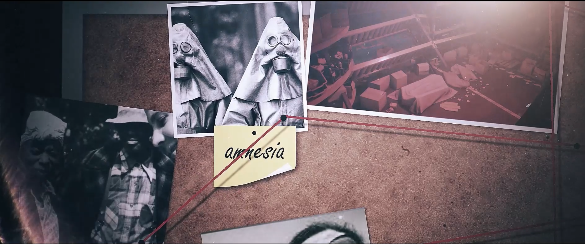
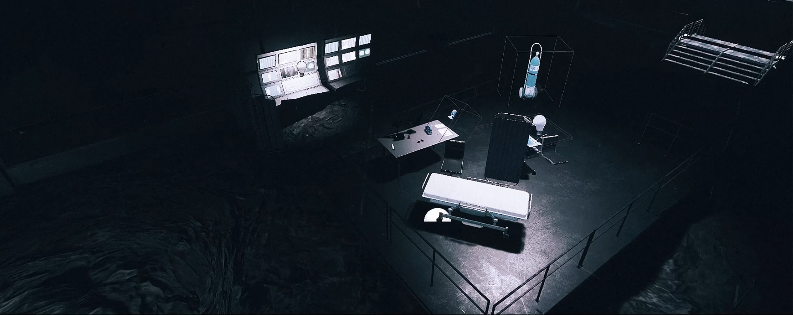

# Project: Unreal Engine 4 Game - Rapid Development Team Project

This repository contains the source code for a game developed in Unreal Engine 4 as part of a university team project focused on rapid game development.

## Project Overview

The game was created within a collaborative, interdisciplinary course offered across HTW, HBKsaar, and UdS universities. Students from Practical Informatics, Media Informatics, Media Culture Studies, and Media Art & Design joined forces to develop a playable game prototype. The project placed a strong emphasis on honing diverse skills such as programming, storytelling, and audiovisual representation. 
It is a first-person game where you have to solve puzzles and find story papers and newspapers.

## Course Details

- **Course Link:** [Rapid Game Development - Summer 2023](https://umtl.cs.uni-saarland.de/teaching/summer-2023/seminar-rapid-game-development-erstellung-eines-computerspiels-in-einem-interdisziplin%C3%A4ren-team.html)
- **Type:** Prototype
- **Implementation Time:** 3 months

## Game Technologies

- **Unreal Engine:** Version 4.27.2
- **Programming Language:** C++
- **3D Modeling:** Blender
- **Integrated Development Environment (IDE):** Visual Studio 2022

## Download

[Download the game prototype - Initial Release](https://github.com/baselsaad/WAS/releases/tag/V1.0)

